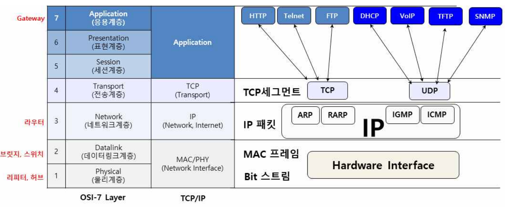

# 정보처리기사 필기

---

## Part 1. 소프트웨어 설계

> **요구사항 분석**

1. 요구사항 파악 : 현행 시스템 파악 - 플랫폼의 기능분석
   
   *플랫폼이란 : 컨텐츠나 아이디어를 배포하고 접근할 수 있는 공간*

2. 플랫폼 기능 분석 : 하드웨어,소프트웨어,서비스(거래,생태계,다면 플랫폼이 있음)플랫폼
   
   *CPND : 컨텐츠, 플랫폼, 네트워크, 디바이스의 약자*

3. 플랫폼 성능 특성 분석

4. 운영체제 분석

5. 네트워크 분석
   
   *계층별 비교 (물데네전세표응)
   
   
   
   각 계층의 단위는 외워두는게 좋음.

6. DBMS(database Management System) 분석
   
   - DBMS는 응용 프로그램의 요청을 수행한다.
   
   - 외부,개념,내부스키마를 계층적으로 구성하여 데이터의 독립성을 제공
   
   - 응용 소프트웨어가 데이터베이스를 직접 조작할 필요가 없어 개발이 용이.

7. 비즈니스융합 분석
   
   - 제품, 서비스,  제품과 ICT융합, 서비스와 ICT융합, 제품의 서비스화, 서비스의 제품화, 제품과 서비스 통합, O2O(오프라인 사용자와 판매자를 온라인으로 연결해주는 서비스 예)요기요, 배민 등등)
